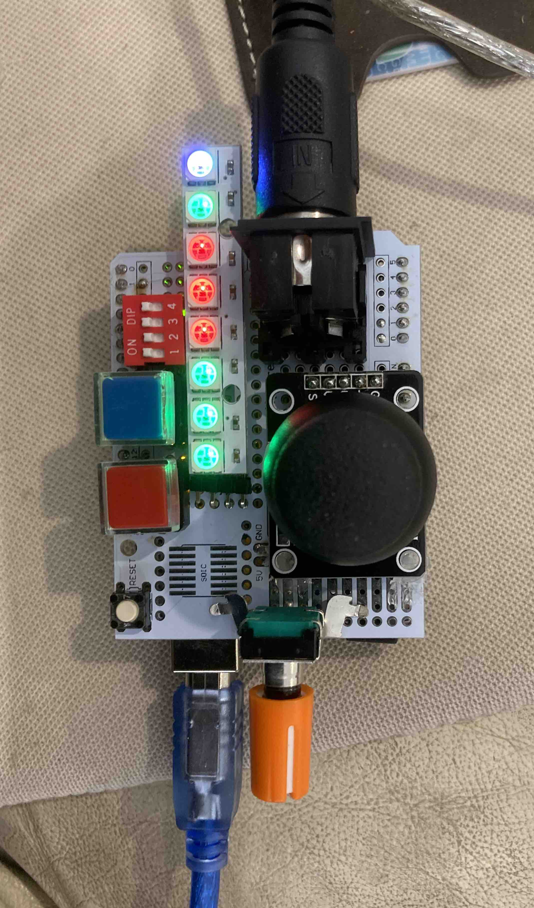
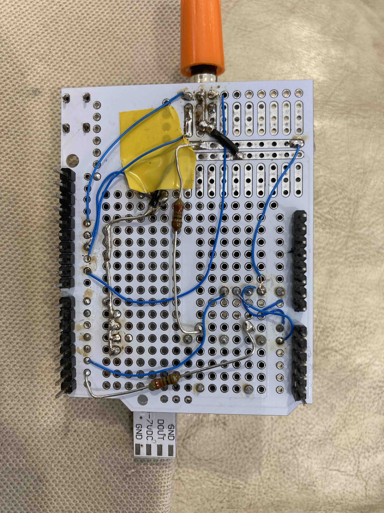

# Patchwork
Joystick MIDI controller inspired by Laurie Spiegel's Music Mouse, and named after the first piece on her album "The Expanding Universe".
(The name is also appropriate because this project was thrown together using bits and pieces from my junk box.)

<table>
  <tr>
    <td></td>
    <td></td>
  </tr>  
</table>

Here is a <a href="Thumb Blues Improvisation.mp4" alt="Video demo">brief video</a> showing it in action.

## Basic use

Connect the DIN5 MIDI out socket to a MIDI device and hit the Enable button to start playing.  Moving the joystick along one axis plays a single note, while moving along the other axis plays a chord made up of a central note plus a 5th down and a sixth up.

## Controls

- Hitting the *Enable* button toggles the sending of MIDI note-on messages.
- Hitting the *Direction* button toggles between the harmony notes all moving in parallel, or the lower note moving contrary to the others.
- Clicking the joystick changes the quantisation between:
  - Chromatic
  - Diatonic major
  - Diatonic minor
  - Pentatonic major
  - Pentatonic minor 
  - Blues
- The first 6 Neopixel LEDs indicate the active quantisation.
- The encoder allows transposition of the output notes:
  - Rotate to choose a transposition interval
  - Click to apply the chosen transposition
  - Long click to cancel transposition.
- The 4 DIP switches control various settings:
  - Switch 1 enables or disables the central harmony note
  - Switch 2 enables or disables the outer harmony notes
  - Switch 3 enables or disables fast play (by controlling how quickly the system responds to joystick movement)
  - Switch 4 switches between fast or slow note changes. When slow, a moving average is use to smooth the notes changes.

## Schematic

The circuit will work with Arduino Uno or Nano, and can very easily be adapted for Teensy and others.

