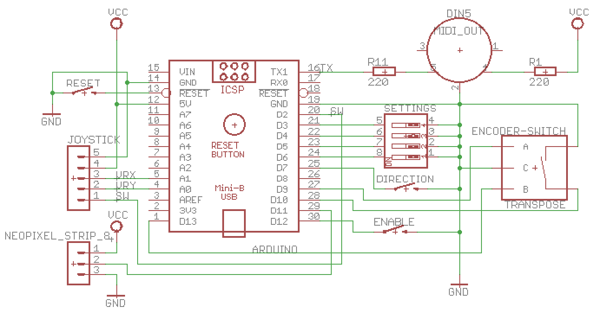

# Patchwork
Joystick MIDI controller inspired by Laurie Spiegel's Music Mouse, and named after the first piece on her album "The Expanding Universe".
(The name is also appropriate because this project was thrown together using bits and pieces from my junk box.)

<table>
  <tr>
    <td></td>
    <td></td>
  </tr>  
</table>

Here is a <a href="Thumb Blues Improvisation.mp4" alt="Video demo">brief video</a> showing it in action.

## Basic use

Connect the DIN5 MIDI out socket to a MIDI device and hit the Enable button to start playing.  Moving the joystick along the x-axis plays a single note with pitch determined by the x position. Moving along the y-axis plays a chord made up of a central note with pitch determined by the y position, plus two additional notes - a 5th down and a sixth up.

## Controls

- Hitting the *Enable* button toggles the sending of MIDI note-on messages.
- Clicking the joystick changes the quantisation between:
  - Chromatic
  - Diatonic major
  - Diatonic minor
  - Pentatonic major
  - Pentatonic minor 
  - Blues
  - Whole tone
- The first 5 Neopixel LEDs indicate the active quantisation
  - 1 LED = chromatic
  - 2 LEDs = diatonic
  - 3 LEDs = pentatonic
  - 4 LEDs = blues
  - 5 LEDS = whole tone 
  - Minor scales are indicated by a change of colour
 - The remaining LEDs flash random colours when new notes are played.
- Hitting the *Direction* button toggles between the harmony notes all moving in parallel, or the lower note moving contrary to the others. The active setting is shown by the colour used for the quantisation LEDs.
- Holding the joystick button down while moving will prevent new notes being sent.
- The encoder allows transposition of the output notes:
  - Rotate to choose a transposition interval
  - Click to apply the chosen transposition
  - Long click to cancel transposition.
- The 4 DIP switches control various settings:
  - Switch 1 enables or disables the central harmony note
  - Switch 2 enables or disables the outer harmony notes
  - Switch 3 enables or disables fast play (by controlling how quickly the system responds to joystick movement)
  - Switch 4 switches between a fast or slow relaxation time for note changes. When slow, a longer moving average is use for smoothing.

## Schematic

The circuit will work with Arduino Uno or Nano, and is easily adapted for Teensy and others.

